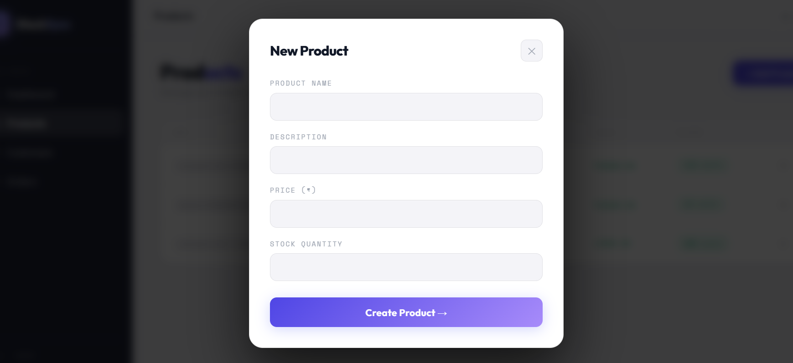
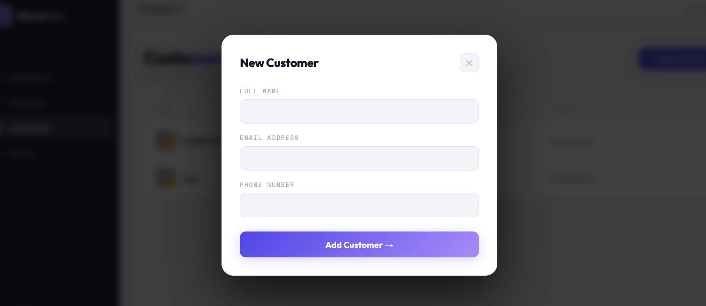
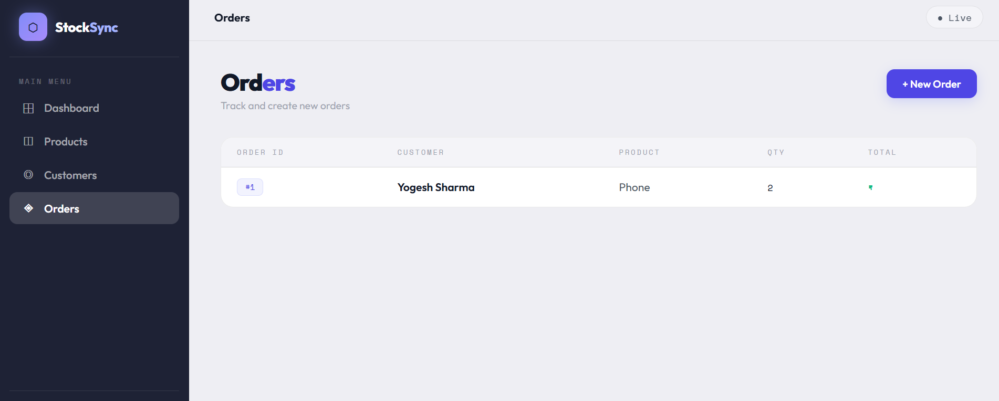

# StockSync - Smart Inventory & Order Tracking Platform

## Project Description

A modern web-based Inventory and Order Tracking Platform designed to streamline product, customer, and order management operations. The system enables businesses to maintain accurate stock records, manage customer information, and process orders efficiently while ensuring inventory consistency.

---

## Application Screenshots

### Dashboard


### Product Management



### Customer Management



### Order Management



---

## Key Functionalities

* Complete Product Management (Create, View, Update, Delete)
* Customer Information Management
* Order Processing and Tracking
* Real-Time Inventory Verification
* Automatic Stock Updates After Order Placement
* Validation to Prevent Orders Beyond Available Inventory
* User-Friendly Interface for Inventory Monitoring

---

## Technology Stack

### Backend

* FastAPI (Python)

### Frontend

* React.js
* Vite

### Database

* PostgreSQL

### Deployment & Containerization

* Docker
* Docker Compose

---

## Application Workflow

1. Products are added and maintained in the inventory.
2. Customer records are managed through dedicated modules.
3. Orders are created based on product availability.
4. The system validates stock before confirming an order.
5. Inventory quantities are automatically adjusted after successful order placement.
6. Orders exceeding available stock are rejected to maintain data accuracy.

---

## Project Structure

```text
StockSync/
│
├── backend/
│   ├── app/
│   ├── requirements.txt
│   └── Dockerfile
│
├── frontend/
│   ├── src/
│   ├── public/
│   └── Dockerfile
│
├── screenshots/
│   ├── dashboard.png
│   ├── products.png
│   ├── customers.png
│   ├── orders.png
│   ├── inventory.png
│   └── order-validation.png
│
├── docker-compose.yml
└── README.md
```

---

## Running the Application

### Backend Setup

```bash
cd backend
uvicorn app.main:app --reload
```

### Frontend Setup

```bash
cd frontend
npm install
npm run dev
```

### Docker Deployment

```bash
docker compose up --build
```

---

## Features Implemented

✅ Product CRUD Operations

✅ Customer CRUD Operations

✅ Order Management System

✅ Inventory Validation Before Order Placement

✅ Automatic Stock Deduction

✅ PostgreSQL Database Integration

✅ RESTful APIs using FastAPI

✅ Dockerized Deployment

✅ Responsive React Frontend

---

## Future Enhancements

* User Authentication & Authorization
* Order Status Tracking
* Sales Analytics Dashboard
* Low Stock Alerts
* Export Reports (CSV/PDF)
* Role-Based Access Control (RBAC)

---

## Author

Yogesh Sharma
